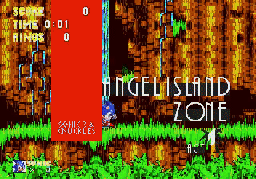

[](https://classroom.github.com/a/inoLPW_E)

<sub>Model Playing Sonic 3 and Knuckles</sub>



# Project Overview
This project aims to train a PPO agent to play Sonic levels from Sonic The Hedghehog, Sonic The Hedghehog 2 and Sonic 3 and Knuckles.

Below are the levels that the agent was trained and tested on:
```
GAME_TO_ZONES = {
    "SonicTheHedgehog-Genesis": [
        "GreenHillZone.Act1",
        "GreenHillZone.Act2",
        "GreenHillZone.Act3",
    ],
    "SonicTheHedgehog2-Genesis": [
        "EmeraldHillZone.Act1",
        "EmeraldHillZone.Act2",
    ],
    "SonicAndKnuckles3-Genesis": [
        "AngelIslandZone.Act1",
    ],
}
```
## Project Structure
```
PlatformerRLAgent/
├── .github/
│ └── .keep # Maintains GitHub folder structure
├── .gitignore # Git ignore rules
├── callbacks.py # Custom training callbacks (logging, checkpoints, eval triggers)
├── env.py # Stable Retro environment creation and configuration
├── main.py # Entry point for running the agent or launching workflows
├── paths.py # Centralized path management for models, logs, and ROM directories
├── README.md # Project documentation
├── test.py # Evaluation and testing script for trained models
├── train.py # PPO training script using Stable Baselines3
├── wrappers.py # Observation/action wrappers for preprocessing and shaping
├── models/ # Saved PPO models and checkpoints
├── logs/ # TensorBoard logs, training metrics, episode stats
└── ROMS/ # Game ROMs (user-supplied, not included in repo)
```

## Libraries
Stable Retro

Stable Baselines


## Setup
Use this guide to install Stable Retro and Stable Baselines3

https://www.youtube.com/watch?v=vPnJiUR21Og

Clone the Repository
```
git clone https://github.com/Muga117/PlatformerRLAgent.git
cd PlatformerRLAgent/
```
Place your Sonic ROMS obtained online in ROMS/ and then import them into Stable Retro.
```
cd ROMS/
python3 -m retro.import
```

Train a New Model
```
python main.py --mode train
```
Access Logs
```
tensorboard --logdir logs/
```
Test the model
```
python main.py --mode test --game SonicTheHedgehog-Genesis --level GreenHillZone.Act1
python main.py --mode test --game SonicTheHedgehog2-Genesis --level EmeraldHillZone.Act1
python main.py --mode test --game SonicAndKnuckles3-Genesis --level AngelIslandZone.Act1
```


